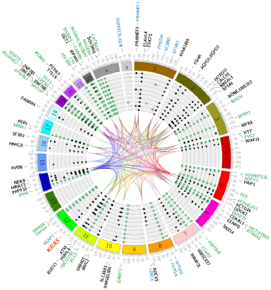

## Treeomics: Decrypting somatic mutation patterns to reveal the evolution of metastatic cancer
Developed by: JG Reiter<sup>1,2,3,4</sup>, A Makohon-Moore, J Gerold, I Bozic, K Chatterjee, C Iacobuzio-Donahue, B Vogelstein, MA Nowak.

<sup>1</sup> Program for Evolutionary Dynamics, Harvard University, Cambridge, MA, USA

<sup>2</sup> IST (Institute of Science and Technology) Austria, Klosterneuburg, Austria

<sup>3</sup> Dana-Farber Cancer Institute, Boston, MA, USA

<sup>4</sup> Broad Institute of MIT and Harvard, Cambridge, MA, USA

<sup>5</sup>
 
========

#### What is Treeomics?
Treeomics is a computational tool to reconstruct the phylogeny of a cancer with commonly available sequencing technologies.


#### Installation:
1. Open a terminal and clone the repository from GitHub with ```git clone https://github.com/johannesreiter/treeomics.git```
2. Install dependencies:
  - Install Python 3.4 ([https://www.python.org/downloads](https://www.python.org/downloads))
  - Install NumPy ([http://www.numpy.org](http://www.numpy.org)), 
    SciPy ([http://www.numpy.org](http://www.numpy.org))
  - Install the IBM ILOG CPLEX Optimization Studio ([http://www-01.ibm.com/support/docview.wss?uid=swg21444285](http://www-01.ibm.com/support/docview.wss?uid=swg21444285))
    and then setup the Python API ([http://www-01.ibm.com/support/knowledgecenter/SSSA5P_12.2.0/ilog.odms.cplex.help/Content/Optimization/Documentation/CPLEX/_pubskel/CPLEX20.html](http://www-01.ibm.com/support/knowledgecenter/SSSA5P_12.2.0/ilog.odms.cplex.help/Content/Optimization/Documentation/CPLEX/_pubskel/CPLEX20.html));
    An IBM Academic License can be obtained here: [http://www-304.ibm.com/ibm/university/academic/pub/page/academic_initiative](http://www-304.ibm.com/ibm/university/academic/pub/page/academic_initiative)
  - If you want any plots to be automatically generated, install also
    matplotlib ([http://matplotlib.org](http://matplotlib.org/)), LaTeX/TikZ (with ```pdflatex``` in your ```PATH``` environment variable; 
    [https://www.tug.org/texlive/quickinstall.html](https://www.tug.org/texlive/quickinstall.html))
    
#### Getting started with Treeomics:
1. Go into the new folder with ```cd treeomics\src```
2. Type the following command to run the simulation: ```python treeomics -r <mut-reads table> -s <coverage table> -O``` 
where ```<mut-reads table>``` is the path to a tab-separated-value file with the number of 
reads reporting a variant (row) in each sample (column) and ```<coverage table>``` is the path to a tab-separated-value 
file with the sequencing depth at the position of this variant in each sample.

Usage: ```python treeomics -r <mut-reads table> -s <coverage table> | -v <vcf file> | -d <vcf file directory> [-n <normal sample name>] -O```

#### Examples:
Example 1: ```python treeomics -r input/Makohon2015/Pam03_mutant_reads.txt -s input/Makohon2015/Pam03_phredcoverage.txt```  
Reconstructs the phylogeny of pancreatic cancer patient Pam03 based on targeted sequencing data 
of 5 distinct liver metastases, 3 distinct lung metastases, and 2 samples of the primary tumor.

Example 2: ```python treeomics -r input/Bashashati2013/Case5_mutant_reads.txt -s input/Bashashati2013/Case5_coverage.txt```
Reconstructs the phylogeny of the high-grade serous ovarian cancer of Case 5 in Bashashati et al. (2013).

### Problems?
If you have any questions, you can contact us and we will do our best to help:
1. [https://www.researchgate.net/profile/Johannes_Reiter](https://www.researchgate.net/profile/Johannes_Reiter)
2. [https://github.com/johannesreiter](https://github.com/johannesreiter)

### License
Copyright (C) 2015 Johannes Reiter

This program is free software: you can redistribute it and/or modify it under the terms of the GNU General Public License as published by the Free Software Foundation, 
version 3 of the License.
There is no warranty for this free software.

========

Author: Johannes Reiter, IST Austria, [http://pub.ist.ac.at/~jreiter](http://pub.ist.ac.at/~jreiter)  
