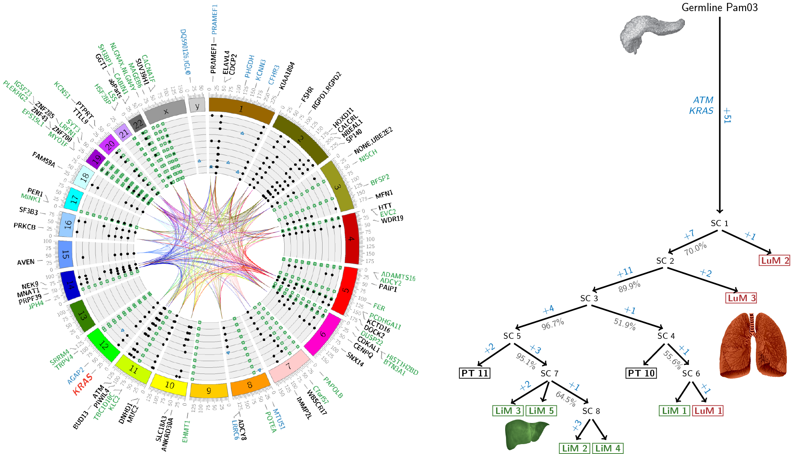

[](https://codecov.io/gh/reiterlab/treeomics)

## Treeomics: Reconstructing metastatic seeding patterns of human cancers
Developed by: JG Reiter, AP Makohon-Moore, JM Gerold, I Bozic, K Chatterjee, C Iacobuzio-Donahue, B Vogelstein, MA Nowak.

 
========

### What is Treeomics?
Treeomics is a computational tool to reconstruct the phylogeny of metastases with commonly available sequencing technologies.
The tool detects putative artifacts in noisy sequencing data and infers robust evolutionary trees across a variety of evaluated scenarios.
For more details, see our publication *Reconstructing metastatic seeding patterns of human cancers* (Nature Communications, 8, 14114, [http://dx.doi.org/10.1038/ncomms14114](http://dx.doi.org/10.1038/ncomms14114)).



* <a href="#installation">Installation</a>
* <a href="#getting">Getting started with Treeomics</a>
* <a href="#examples">Examples</a>

#### <a name="releases"> Releases
* Treeomics 1.5.2 2016-10-18: Initial release with acceptance of the manuscript.
* Treeomics 1.6.0 2016-12-09: Improves visualization of generated evolutionary trees by integrating ETE3. ILP solver explores a pool of the best solutions to more efficiently assess the support of the inferred branches.
* Treeomics 1.7.0 2017-02-09: Uses Bayesian inference model for similarity and artifact analyses.
* Treeomics 1.7.1 2017-02-23: Integrated python packages ```pyensembl``` and ```varcode``` to infer the gene names where variants occurred as well as their mutation effect.
* Treeomics 1.7.2 2017-03-02: Improved visualization of predicted driver genes in HTML report and the mutation table.
* Treeomics 1.7.3 2017-03-13: Visualize the 5 most likely evolutionary trees. Improve solution pool usage to better estimate confidence values.
* Treeomics 1.7.4 2017-03-15: Make mutation effect prediction by VarCode optional to reduce dependencies for users.
* Treeomics 1.7.5 2017-04-11: Improved putative driver gene analysis and HTML report. Allow multiple normal samples. Implemented optional filter of common normal variants.
* Treeomics 1.7.6 2017-05-12: Generate new out put file ```<subject>_variants.csv``` with information about the individual variants and how they were classified in the inferred phylogeny. Solved issues with subclone detection and solution pool.
* Treeomics 1.7.7 2017-06-21: Made Treeomics ready for ultra deep targeted sequencing data. Fixed bug in calculation of branch confidence values in partial solution space. Use wkhtmltopdf to create a PDF from the HTML report.
* Treeomics 1.7.8 2017-10-06: Fixed problem with ete3 visualization of detected subclones. Added additional command line parameters: path to CSV file to highlight given genes in inferred phylogeny and set the maximal number of used threads by CPLEX.
* Treeomics 1.7.9 2017-10-10: Configure the number of top ranked solution trees that are plotted.
* Treeomics 1.7.10 2018-05-15: Improved PDF-report generation. Added support for structural variants. Added support for providing externally estimated sample purities via ```--purities <SAMPLE NAMES>```. Added ```--verbose``` option to run Treeomics in DEBUG logging level. Fixed VCF parsing error thanks to Frank's bug report.
* Treeomics 1.7.11 2018-10-26: Added TCGA consensus driver gene list from Bailey et al., Cell 2018. Added Zoom parameter to ```settings.py``` to better configure PDF report appearance. 
* Treeomics 1.7.12 2018-11-26: Replaced 'nodes_iter()' and 'edges_iter()' calls with 'nodes()' and 'edges()' calls because networkx 2.0+ has no backward compatibility: https://stackoverflow.com/questions/33734836/graph-object-has-no-attribute-nodes-iter-in-networkx-module-python
* Treeomics 1.7.13 2020-02-04: Create output files with genetic distance and Jaccard similarity coefficients for sample pairs.
* Treeomics 1.8.0 2020-03-13: Major refactoring to create a proper package for easier installation and usability.
* Treeomics 1.8.1 2020-07-15: Updated wkhtmltopdf package requires option 'enable-local-file-access' to generate a pdf report.
* Treeomics 1.9.0 2020-08-20: Upgraded the treeomics package to python 3.6 and fixed issue related to negative dimensions for mutation plot.
* Treeomics 1.9.1 2020-09-01: Implemented additional filters.
* Treeomics 1.9.2 2020-10-27: Updated dependencies and improved installation explanation.

### <a name="installation"> Installation
1. Easiest is to install Miniconda [https://www.continuum.io](https://www.continuum.io) and create a new python environment in a terminal window with ```conda create --name treeomics python=3.6``` and activate it with ```conda activate treeomics```
2. Clone the repository from GitHub with ```git clone https://github.com/reiterlab/treeomics.git```
3. Create distribution packages by going into the main folder with ```cd <TREEOMICS_DIRECTORY>```, run ```python setup.py clean sdist bdist_wheel``` and install treeomics to your python environment by executing ```pip install -e <TREEOMICS_DIRECTORY>```
4. Install the IBM ILOG CPLEX Optimization Studio 12.10 ([http://www-01.ibm.com/support/docview.wss?uid=swg21444285](http://www-01.ibm.com/support/docview.wss?uid=swg21444285))
    and then setup the Python API ([https://www.ibm.com/support/knowledgecenter/en/SSSA5P_12.10.0/ilog.odms.cplex.help/CPLEX/GettingStarted/topics/set_up/Python_setup.html](https://www.ibm.com/support/knowledgecenter/en/SSSA5P_12.10.0/ilog.odms.cplex.help/CPLEX/GettingStarted/topics/set_up/Python_setup.html));
    An IBM Academic License to freely download CPLEX can be obtained here: [https://www.ibm.com/academic/home](https://www.ibm.com/academic/home). 
    To install the cplex python package in MacOS go to ```cd /Applications/CPLEX_Studio1210/cplex/python/3.6/x86-64_osx/``` and run ```python setup.py install```. Test your installation with ```python -c 'import cplex'```.
    You may also need to add cplex to your ```PYTHONPATH``` with: ```export PYTHONPATH="~/Applications/CPLEX_Studio1210/cplex/python/3.6/x86-64_osx/:$PYTHONPATH"```
5. Install optional packages:
  - To automatically generate annotated evolutionary tree plots, install ETE3 [https://github.com/etetoolkit/ete](https://github.com/etetoolkit/ete) which requires Qt: ```conda install python=3.6 qt=5``` and then install ete3 ```conda install -c etetoolkit ete3 ```. You can test your installation with ```python -c 'from ete3 import TreeStyle'```.
  - To annotate only non-synonymous variants in driver genes, install pyensembl ([https://github.com/hammerlab/pyensembl](https://github.com/hammerlab/pyensembl)) and varcode ([https://github.com/hammerlab/varcode](https://github.com/hammerlab/varcode)) with ```pip install varcode``` and ```pyensembl install --release 75 76```
  - To automatically generate less nicely visualized evolutionary trees than with ETE3, install LaTeX/TikZ (with ```pdflatex``` in your ```PATH``` environment variable;
    [https://www.tug.org/texlive/quickinstall.html](https://www.tug.org/texlive/quickinstall.html))
  - To automatically generate evolutionary conflict graphs, install circos (with ```circos``` in your ```PATH``` environment variable; [http://circos.ca/software/installation](http://circos.ca/software/installation))
6. Test installation with ```cd <TREEOMICS_DIRECTORY>``` and ```python setup.py test``` (or ```pytest tests/```) and ```python -c 'import treeomics'```
7. To uninstall the package use ```pip uninstall treeomics``` or ```conda remove treeomics``` and delete the conda environment with ```conda env remove --name treeomics```

### <a name="getting"> Getting started with Treeomics
1. Input files: The input to ```__main__.py``` is either
  - two tab-delimited text files -- one for variant read data and one for coverage data. Please see the files ```input/Makohon2017/Pam03_mutant_reads.txt``` and ```input/Makohon2017/Pam03_phredcoverage.txt``` included in this repository for examples.
  - VCF-files of all samples
2. Type the following command to run the tool: ```treeomics -r <mut-reads table> -s <coverage table>``` 
where ```<mut-reads table>``` is the path to a tab-separated-value file with the number of 
reads reporting a variant (row) in each sample (column) and ```<coverage table>``` is the path to a tab-separated-value 
file with the sequencing depth at the position of this variant in each sample.

##### Usage: 
```shell
$ treeomics -r <mut-reads table> -s <coverage table> | -v <vcf file> | -d <vcf file directory>
```

##### Optional parameters:
- *-e <sequencing error rate>:* Sequencing error rate *e* in the Bayesian inference model (default 1.0%)
- *-a <max absent VAF>:* Maximum VAF for an absent variant *f<sub>absent</sub>* before considering the estimated purity (default 5%)
- *-z <prior absent probability>:* Prior probability for a variant being absent *c<sub>0</sub> (default 0.5).
- *-o <output directory>:* Provide different output directory (default ```output```)
- *-n <normal sample names>:* If a normal sample is provided, variants significantly present in the normal are removed. Additional normal samples can be provided via a space-separated enumeration. E.g. ```-n FIRSTNORMALSAMPLE SECONDNORMALSAMPLE ```
- *-x <samples to exclude>:* Space-separated enumeration of sample names to exclude from the analysis. E.g. ```-x FIRSTEXCLUDEDSAMPLE SECONDEXCLUDEDSAMPLE ```
- ```--pool_size``` *<Pool size of ILP solver>:* Number of best solutions explored by ILP solver to assess the support of the inferred branches (default 1000)
- *-b <No bootstrapping samples>:* Number of bootstrapping samples (default 0); Generally using the solution pool instead of bootstrapping seems to be the more efficient way to assess confidence.
- *-u:* Enables subclone detection (default ```False```)
<!--- - ```--no_subclone_detection``` Disables subclone detection) -->
- *-c <min median coverage>:* Minimum median coverage of a sample to be considered (default 0)
- *-f <min median vaf>:* Minimum median mutant allele frequency of a sample to be considered (default 0)
- *-p <false positive rate>:* False-positive rate of conventional binary classification (only relevant for artifact comparison)
- *-i <false discovery rate>:* Targeted false-discovery rate of conventional binary classification  (only relevant for artifact comparison)
- *-y <min absent coverage>:* Minimum coverage for a powered absent variant  (only relevant for artifact comparison)
- *-g <reference genome>:* provide used reference genome for mutation consequence annotation; supporting grch37 (for hg19; default), grch36 (for hg18), and grch38 (for hg38); E.g. ```-g grch38```
- *-t <time limit>:* Maximum running time for CPLEX to solve the MILP (in seconds, default ```None```). If not ```None```, the obtained solution is no longer guaranteed to be optimal
- ```--threads=<N>``` Maximal number of parallel threads that will be invoked by CPLEX (```0```: default, let CPLEX decide; ```1```: single threaded; ```N```: uses up to N threads)

- ```-l <max no MPS>:``` Maximum number of considered mutation patterns per variant (default ```None```). If not ```None```, the obtained solution is no longer guaranteed to be optimal
- ```--driver_genes=<path to file>``` Path to CSV file with names of putative driver genes highlighted in inferred phylogeny (default ```--driver_genes=../input/Tokheim_drivers_union.csv```)
- ```--wes_filtering``` Removes intronic and intergenic variants in WES data (default ```False```)
- ```--common_vars_file``` Path to file with common variants in normal samples and therefore removed from analysis (default ```None```)
- ```--no_plots``` Disables generation of X11 depending plots (useful for benchmarking; default plots are generated ```plots```)
- ```--no_tikztrees``` Disables generation of latex trees which do not depend on X11 (default latex trees are generated ```tikztrees```)
- ```--benchmarking``` Generates mutation matrix and mutation pattern files that can be used for automatic benchmarking of silico data (default ```False```)
- ```--include``` Provide a list of sample names that should be analyzed (e.g., ```--include PT1 PT2 PT3 PT4```)
- ```--purities``` Provide a list of externally estimated sample purities (e.g., ```--purities 0.7 0.3 0.9 0.8```). Requires ```--include``` argument with the same ordering of samples.
- ```--min_var_reads <>``` and/or ```--min_vaf <>``` Minimum VAF of a variant in at least one of the provided samples with a minimum number of variant reads
- ```--min_var_cov <>``` minimum coverage of a variant across all samples, otherwise the variant is excluded

Default parameter values as well as output directory can be changed in ```treeomics/settings.py```.
Moreover, the ```settings.py``` provides more options an annotation of driver genes and configuration of plot output names. 
All plots, analysis and logging files, and the HTML report will be in this output directory.

##### Optional input:
- *Driver gene annotation:* Treeomics highlights any non-synonymous or splice-site variants (if VarCode is available, otherwise all) in putative driver genes given in a CSV-file under ```DRIVER_PATH``` in ```treeomics/settings.py```. As default list, the union of reported driver genes by 20/20+, TUSON, and MutsigCV from Tokheim et al. (PNAS, 2016) is used (see ```input/Tokheim_drivers_union.csv```). Any CSV-file can be used as long as there is column named 'Gene_Symbol'. Variants in these provided genes will be highlighted in the HTML report as well as in the inferred phylogeny.
- *Cancer Gene Census (CGC) annotation:* Variants that have been identified as likely drivers in the provided genes (under ```DRIVER_PATH```) will be check if they occurred in the reported region in the given CSV-file (default ```input/cancer_gene_census_grch37_v80.csv```; CGC version 80, reference genome hg19).

### <a name="examples"> Examples
Example 1:
```shell
$ treeomics -r input/Makohon2017/Pam03_1-10_mutant_reads.txt -s input/Makohon2017/Pam03_1-10_phredcoverage.txt -n Pam03N3 -e 0.005
```
Reconstructs the phylogeny of pancreatic cancer patient Pam03 based on targeted sequencing data 
of 5 distinct liver metastases, 3 distinct lung metastases, and 2 samples of the primary tumor.

Example 2:
```shell
$ treeomics -r input/Bashashati2013/Case5_mutant_reads.txt -s input/Bashashati2013/Case5_coverage.txt -e 0.01
```
Reconstructs the phylogeny of the high-grade serous ovarian cancer of Case 5 in Bashashati et al. (2013).

Example 3:
```shell
$ treeomics -v input/example.vcf
```
Reconstructs the phylogeny of a simulated cancer with 6 metastases from a given VCF file (see [input/example.vcf](input/example.vcf)).
Regarding the VCF file input format, Treeomics expects the standard columns: #CHROM, POS, ID, REF, ALT, QUAL, FILTER, INFO, FORMAT as well as for each considered sample an additional column.
Minimally AD (Allelic depth) has to be provided in the FORMAT column and then the actually observed number of reference and alternate alleles in each sample in their corresponding columns).
The generated output can be found in ```output/example_output``` and the corresponding Treeomics report at [output/example_output/example_6_e=0_01_c0=0_5_af=0_05_report.pdf](output/example_output/example_6_e=0_01_c0=0_5_af=0_05_report.pdf).

========

### Problems?
If you have any questions, you can contact us ([https://reiterlab.stanford.edu](https://reiterlab.stanford.edu)) and we will try to help.


### License
Copyright (C) 2017 Johannes Reiter

Treeomics is licensed under the GNU General Public License, Version 3.
This program is free software: you can redistribute it and/or modify it under the terms of the GNU General Public License as published by the Free Software Foundation, 
version 3 of the License.
There is no warranty for this free software.

========

Author: Johannes Reiter, Stanford University, [https://reiterlab.stanford.edu](https://reiterlab.stanford.edu/)  
